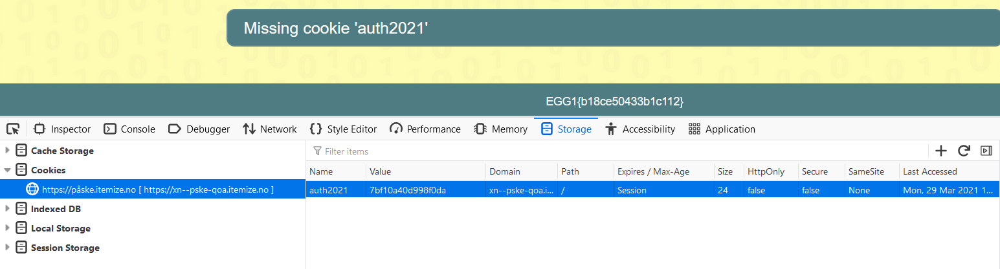
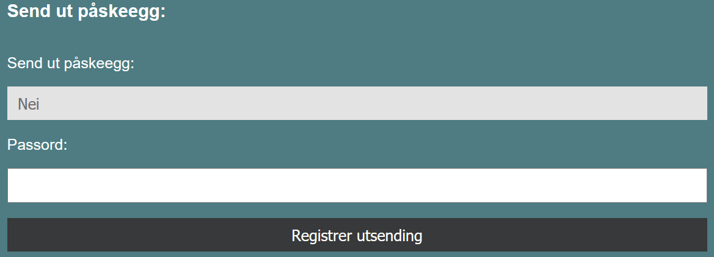
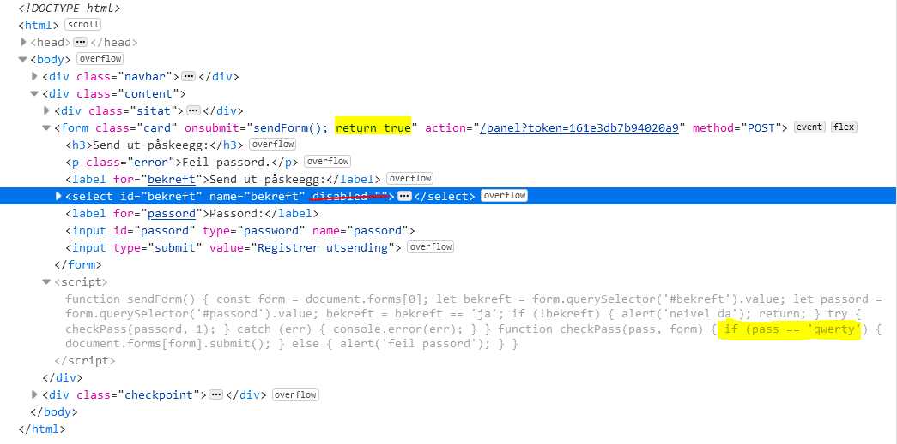

# Writeup Itemize Påskenøtter 2021 🐣

Påskeharen hadde problemer med årets levering av påskeegg på https://påske.itemize.no/

## Egg 0
Ligger nederst på nettsiden.

## Egg 1

På Login-siden må man logge inn med brukernavn og passord. Antar at man må bruke SQL-injection i passord-feltet. For eksempel kan man skrive `' OR 1=1; -- -`. Dette funker og vi kommer til en ny side med egget.

## Egg 2

På den nye siden dukker meldingen `Missing cookie 'auth2021'` opp. Dette er et greit hint om at vi bør sjekke cookies. Ved å bruke høyreklikk og "inspiser element" i nettleseren kan vi gå til "storage" for å se på cookies. 

Endre fra auth2020 til auth2021 og last inn siden på nytt så får vi egg 2.

## Egg 3

Påskeharen ønsker å registrere hvilken by som fikk flest egg i fjor, men statistikken laster ikke inn på siden. Uten statistikken klarer vi ikke å registrere dette. Vi får derimot to bilder, "Egg produksjon status februar 2021" og "Vinnere av fjorårets eggjakt". Å finne noe egg fra bildene steganografisk gir ingen resultat. Men påskeharen gir et hint om at han har tabellfiler liggende rundt et sted. Bildefilene ligger i en mappe kalt "haredata", så vi navigerer oss til https://påske.itemize.no/haredata/.
Her ser flere filer. Det er lite å få ut av bildene. Ser derfor først på "flagg3". Det er ikke klart hvilken type fil det er. Jeg kjørte kommandoen `strings flagg3` og egget poppet ut. I ettertid ser jeg at det bare er å åpne filen i notepad for å få flagget.

## Egg 4

Denne hoppet jeg initielt over, men det er bare å bruke kommandoen
```bash
openssl aes-256-cbc -md sha512 -in original.fil.kryptert -out original.fil -d
```
som vi finner i `it-sikkerhets-guide-for-fillagring.md`. Der finner vi også passordet `PåskeDrift Passord!`, som er lik på alle de krypterte filene, denne inkludert. Man kunne gjette at dette var passordet ettersom det ikke var noe annet relevant der. Dessuten er det vel typisk at IT-drift er litt slappe med passord.
På den dekrypterte filen kan vi kjøre `strings flagg4`.

## Egg 5

Først må vi dekryptere .csv-filene på likt vis som flagg4. Her er statistikken påskeharen ønsker. Vi kan se på filene med `cat` eller åpne i excel. Dataen er dessverre ganske rotete. Å løse dette manuelt er ikke anbefalt. 
Problemet i `egg_by.csv` er at det er flere ulike registreringer av By-ID av ulike hjelpere. I `by_id.csv` er samme by registrert med flere ulike By-IDer. 
Vi kan lage et program som først samler sammen alle eggene til hver by-id i `egg_by.csv`. Deretter bruke dette til å samle sammen alle by-idene til byene i `by_id.csv`.
```
import pandas as pd
import numpy as np

# Legg egg inn i array
data = pd.read_csv('egg_by.csv')
byer = pd.read_csv('by_id.csv')
sum_array = np.zeros(159, dtype=int)

for i in range(data.index.size):
  sum_array[data.at[i, 'By-ID']] += data.at[i, 'Antall egg']

# Sett sammen egg fra byer
by_array = []
egg_array = []

for i in range(sum_array.size):
  if byer.at[i, 'By'] in by_array:
    egg_array[by_array.index(byer.at[i, 'By'])] += sum_array[i]
  else:
    by_array.append(byer.at[i, 'By'])
    egg_array.append(sum_array[i])

# Finn maks
np_array=np.array(egg_array)
item=(np.max(egg_array))
item_index=np.where(np_array==item)
print(item_index) # 32
print(by_array[32]) # Kristiansund
print(item) # 2652
```

*Stygg kode, hva så?*

Svaret vi får er at Kristiansund med 2652 egg er byen som fikk flest egg i fjor. Registrerer dette for å få egg og gå videre.

## Egg 6

Til slutt gjenstår det bare å sende ut påskeeggene. Dessverre fungerer ikke skjemaet til påskeharen.

Ved å bruke "inspiser element" kan vi endre på koden på klientsiden. 
Begynner først med å fjerne "disabled" slik at vi kan endre "Send ut påskeegg" til Ja. Etter litt leting ser vi også at passordet er "qwerty". Men skjemaet fungerer fortsatt ikke? Til slutt må vi endre det slik at skjemaet returnerer True. 

Da kan vi sende ut påskeeggene og påsken er reddet nok en gang 🐰 