# Writeup Påskenøtter PST 2021 🐣
## Mysteriet på Harefjell vinterresort
Denne påsken kom PST med til sammen fire påskenøtter i form av en tegneserie på https://p26e.dev/. På Harefjell vinterresort har Påske Haren invitert noen gjester, men det blir trøbbel når Eggschange-serveren kræsjer.

Om konkurransen: De 25 raskeste til å løse oppgaven hver dag havnet i berømmelsesskyen. Man fikk ett lodd for hver gang man havnet der. Jeg fikk 2/4 lodd, men jeg kunne nok ha fått ett til om jeg startet tidligere på dag 1.


## Skjærtorsdag
Til å begynne med er det kun litt detektivarbeid som skal til. I tegneserien ser vi at Anetti Bac tar et bilde til Instagram, og tagger Mikael Foks https://www.instagram.com/mikaelfoks1337/. Vi kan sjekke Instagramprofilen til Mikael, men det er ingen bilder der. I bioen hinter han til at vi kan finne han der fuglene kvitrer; en referanse til Twitter. 


Når vi søker opp Mikael Foks på twitter (https://twitter.com/FoksMikael) ser vi at han har linket til https://robotanekjem.p26e.dev/ i bioen sin. Nettsiden inneholder noen robotemojier🤖. Den drevne hackeren skjønner at man bør sjekke robots.txt (les dette https://en.wikipedia.org/wiki/Robots_exclusion_standard). Dette er en fil som typisk er på nettsider, og en gjenganger i CTF-oppgaver. Inne på https://robotanekjem.p26e.dev/robots.txt finner vi en lenke til flagget `PST{snart_er_det_SOMEr}`. 


## Langfredag
I dag kræsjet Eggschange-serveren. Vi får en event log som beskriver hendelsene. Scroller man helt ned så ser vi at en ny oppdatering forårsaket at det hele kræsjet. Oppdateringen kommer fra `git@paaschecomsulting/eggschange`.


Inne på github så kan vi finne profilen til Paasche Consulting, https://github.com/paaschecomsulting. Vi laster ned filene til eggschange og ser på de!

`Hjelp_1` og `Hjelp_2` ser lite nyttige ut, mens `Påskenott.ps1` og `module.psm1` ser mer interessante ut ved første øyekast. Et raskt søk viser at disse filene må kjøres i Windows Powershell. Run as Administrator og kommandoen `Set-ExecutionPolicy -ExecutionPolicy Unrestricted` gir meg muligheten til å kjøre `Påskenott.ps1`. Dette er Eggschange-serveren sin oppgraderingsveileder. 

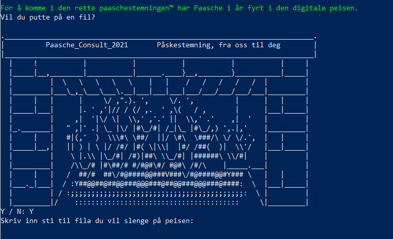

Det er en litt langsom prosess, men ellers ikke vanskelig. Man må blant annet putte en fil på peisen (som slettes). 
En noe komplisert oppgraderingsprosess senere så går musepekeren amok. Kult. 

Jeg går videre med å se på funksjonene i `module.psm1` (som har blitt importert ved hjelp av oppgraderingsveilederen). Det er mye rart i koden! Etter litt testing så ser det ut til at kun `Test-EggchangeFlag` er relevant, men den krever en nøkkel.

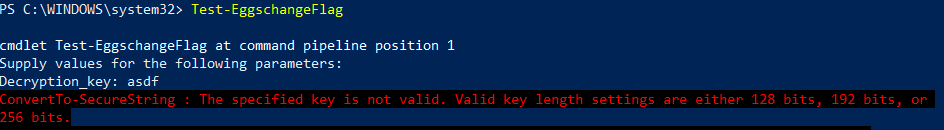

 Personlig prøvde jeg mye rart for å finne en nøkkel, bl.a. tenkte jeg på postit-lappen i dagens oppgave. Men, vi får jo en melding om å spørre om hjelp?

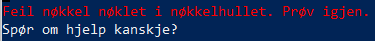
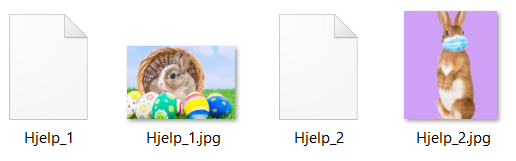

 Jeg hadde allerede prøvd steganografi på bildene som poppet ut av `Hjelp_1` og `Hjelp_2` fra oppgraderingsveilederen, men kunne ikke finne noe nyttig. Til slutt så jeg en sammenheng mellom bildene og en kodesnutt. Det er nevnt MD5 både i bildene (kan laste de opp i f.eks. CyberChef) og i `Get-EggschangeEggHash`. 

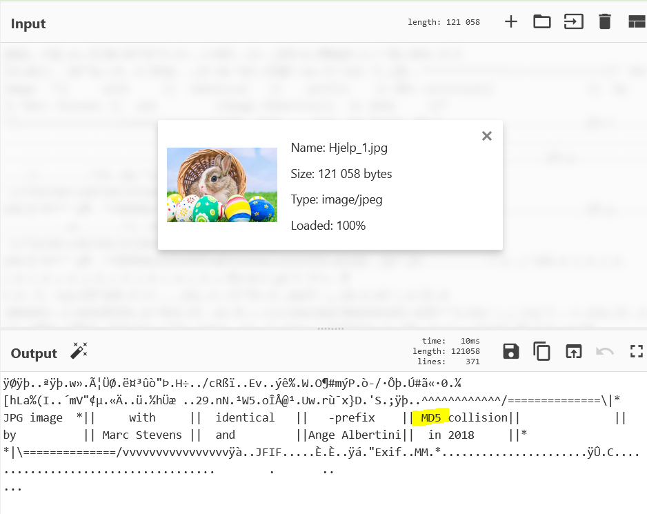

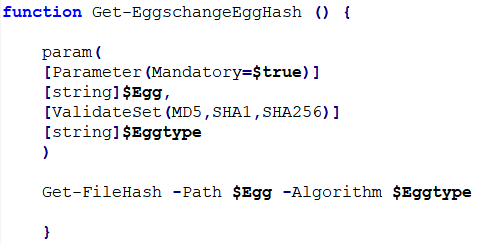

Ved å kjøre `Get-FileHash -Path $Egg -Algorithm $Eggtype` der $Egg er fillokasjon til bilde (begge gir samme svar) og $Eggtype lik MD5 så dukker nøkkelen vi ønsker opp! Nøkkelen er `4A981C87EF142F95D04424A29235DCFC`. Denne gir oss flagget når vi kjører `Test-EggchangeFlag`. Flagget er `PST{PaascheStemning_og_Kraftskall}`


## Første påskedag
Denne dagen var ganske mye vanskligere. I PCAP-en ser vi kommunikasjonen på Harefjell mellom Eggnett-client og Eggschange server. Bruk Høyreklikk->Follow TCP for å se dette i Wireshark.
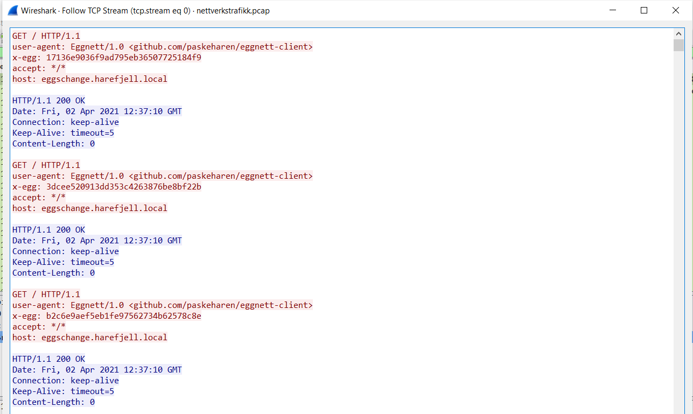 
*Utklipp av de første pakkene*

Vi ser også link til Githuben til paskeharen. På Github ligger Eggnett-client, https://github.com/paskeharen/eggnett-client. Vi laster ned `cargo`, og deretter Eggnett-client med `cargo install --git https://github.com/paskeharen/eggnett-client`. Kommandoen `eggnett-client -h <hemmelighet> <destinasjon>` lar oss sende meldinger til en mottaker. Jeg skjønte umiddelbart at hemmeligheten var `43mm3l1g437` fra post-it lappen i gårsdagens oppgave.

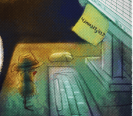

 Etter å ha testet ut kommandoen litt innså jeg at jeg måtte sende meldinger til meg selv for å kunne motta noe. 
 
 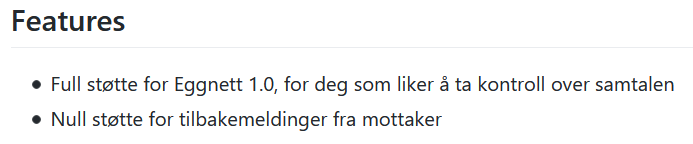
 
*Ingen støtte for tilbakemelding*
 
 
 Satte derfor opp en enkel server med Python (https://gist.github.com/mdonkers/63e115cc0c79b4f6b8b3a6b797e485c7) og sendte meldinger til meg selv. I Eggnett-client-koden ser jeg at hvert tastetrykk blir satt sammen med hemmeligheten og deretter gjort om til md5. Dette passet også med meldingene som ble sendt over til serveren min. 
 
  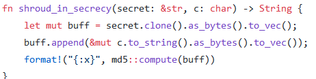

 
Jeg bestemte meg for å sende over et tegnsett til serveren for å få tilsvarende md5-hasher. 
```
INFO:root:GET request,
Path: /
Headers:
user-agent: Eggnett/1.0 <github.com/paskeharen/eggnett-client>
x-egg: 94cbb3a4b2e22b5ef84ca64be6c40349
accept: */*
host: 127.0.0.1:8080


127.0.0.1 - - [03/Apr/2021 12:16:06] "GET / HTTP/1.1" 200 -
INFO:root:GET request,
Path: /
Headers:
user-agent: Eggnett/1.0 <github.com/paskeharen/eggnett-client>
x-egg: 4fec921603cd09123a2b87439c5aab49
accept: */*
host: 127.0.0.1:8080

...
```
Ryddet litt opp i det jeg mottok med `grep` og `sed`, og lagret det i en fil. Deretter lagde jeg et skript i Python som lot meg sjekke hashene opp mot tegnsettet mitt (`hemmelig-melding.ipynb`). Det finnes kanskje bedre metoder enn dette, men det var det jeg så på som mest intuitivt. Jeg hadde skjønt på dette tidspunktet at jeg måtte dekode hashene fra PCAP-filen, så jeg lagret hashene her og ryddet opp slik at det lett lot seg lese i Python. Hashene i PCAP-en var altså sendt som `X-EGG: <payload>`. Meldingen som ble sendt: 
```
BEGYNN
EGGNETT KONFIGURASJON SETT oppdateringskilde TIL https://github.com/paaschecomsulting/eggschange
EGGNETT KONFIGURASJON SETT OBFUSKERT flagg TIL When the stars line up And you catch a break People think you're lucky
``` 
Jeg trodde jeg var i mål, men det stoppet faktisk opp her denne dagen. Det var MANGE kaninhull å grave seg i, og jeg vil tro flere hengte seg opp i at flagget var gjemt i denne meldingen på et vis. 

Senere fikk jeg et hint om at meldingen bare var et hint, og jeg fikk et nytt spor å grave i. Sangen er for øvrig kalt Timing Is Everything, og er det eneste relevante i meldingen. Jeg fikk vite at flagget gjemte seg i PCAP-en, og at tegneserien gir et viktig hint. Jeg klarte å grave meg i nye hull, men fikk da også vite at man burde se pakkene bli sendt som en graf. Dette kan blant annet gjøres med `Statistics->TCP Stream Graphs->Time Sequence (Stevens)`.
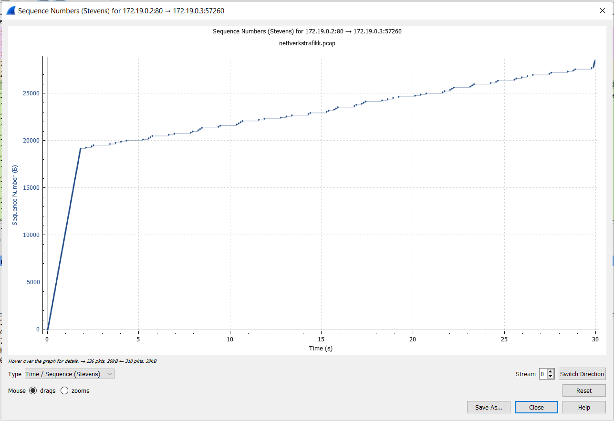

Fra tegneserien hadde jeg vært på sporet av morsekode, men jeg klarte ikke å finne tegnene ut i fra timingtallene alene. Grafen gjør ting mye lettere! 


Hvis man ser nøye etter så kan man tolke timingen mellom pakkene som morsekode, derav hintet Timing Is Everything. Morsekoden `--. --- -.. - .-.. . ... - -- . .-.. .-.. .-.. --- -- .-.. .. -. .--- . -. .` tilsvarer `GODTLESTMELLLOMLINJENE`, som er flagget (omkranset av PST{}). Veldig kløktig gjemt melding!


## Andre påskedag
For mange så var dette en enkel oppgave, mens for andre så var det fort gjort å snu på feil stein. Heldigvis så tok ikke denne mange minutter for meg, noe som var godt etter gårsdagens oppgave. Jeg begynte med å sjekke `tastatur-og` på tumblr (https://tastatur-og.tumblr.com/), og der var det et bilde.  Åpner man dette så kommer man til flickr. Der kan man se EXIF-info der det bl.a. står at man bare skal sende en mail for å få flagget. 

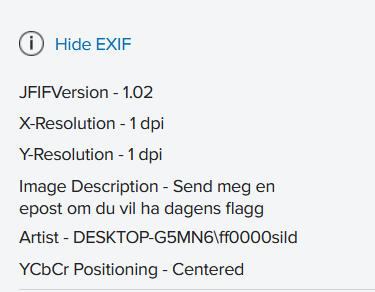

Dessverre står ikke mailen noe sted. Heldigvis hadde jeg funnet mailen tidligere. Da jeg så at Artist var `ff0000sild` (red herring, litt slemt å kalle seg for det), så husket jeg at jeg mailen lå inne på Ubuntu keyservers. I eggschangeoppdateringen så la gjerningsmannen igjen en fingerprint som var lastet opp i Ubuntu keyservers. Altså må man tilbake til dag 2 for å lete etter flagget. Det er i funksjonen `Set-EggschangeUpgradeSettings` at man ser `DeveloperFingerprint`. Det som er lurt å se er `$UbuntuKeyserverUploaded=$true` som betyr at fingerprintet er lastet opp i Ubuntu keyservers.

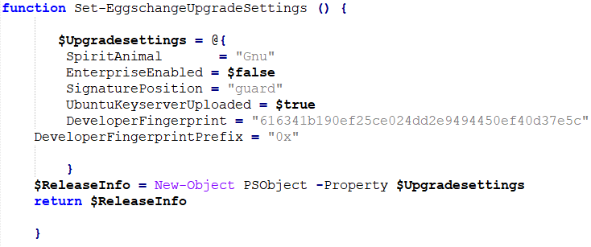

 Sjekker man https://keyserver.ubuntu.com/pks/lookup?search=0x616341b190ef25ce024dd2e9494450ef40d37e5c&fingerprint=on&op=index så finner vi mailadressen. 
 
 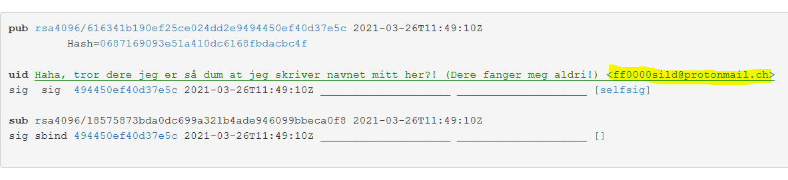
 
Vi sender en mail og får flagget `PST{tr4ckp4d_3r_n0e_he2k!}`. Det er Mette Traakpad som lager kvalm!

